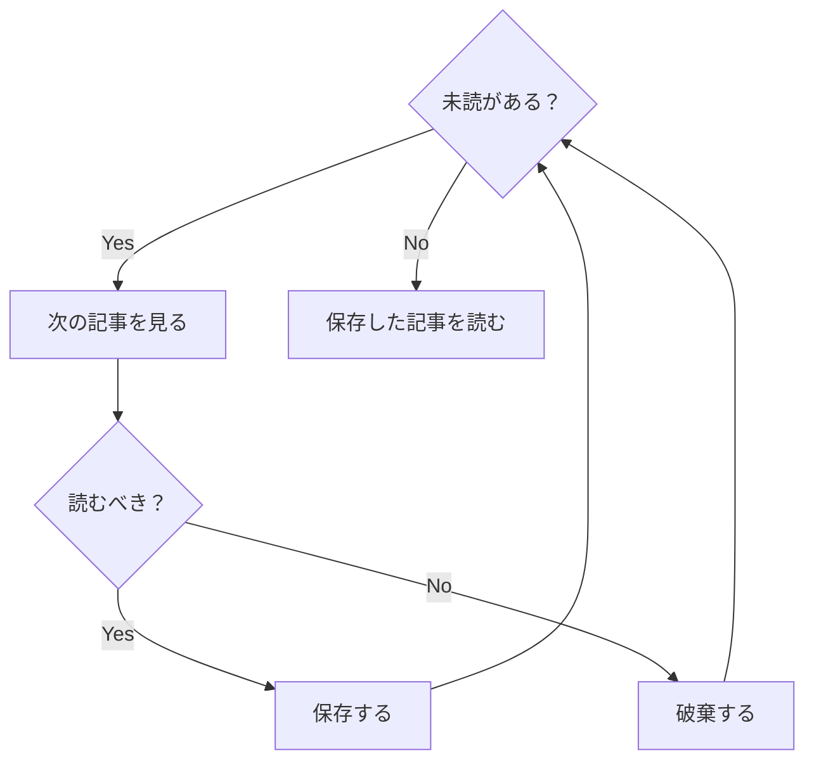

巷のRSSリーダーはほぼすべてが「新着をすべて溜め込んでLIFO（FIFOが可能な場合もあるが）に処理していく」というUXなわけだが、この形式だと、とかく未読を溜めてしまいがちだった。特にAIの時代になってからはインプットの流量も多くなり、その傾向は加速している。

もっと異なる形でRSSを読んでもいいのではないかと思い、最近はVibe Codingで作ったツールでRSSを読むようにしている。

## 新着をすべて読むのではなく、AIに厳選させる

そもそもLIFO式にRSSを処理するプロセスがどういうものかと言えば、以下のように認識している。

ネックになるのは、そもそもすべての新着記事を読むわけではなく、読むべきかどうかのフィルタを掛ける必要がある点だろう。慣れればタイトルだけでパパッと読み飛ばしてもいけるが、数日リーダーを開かずにいると数百件未読が溜まったりするわけで、それらすべてをフィルタするのは重労働になり、リーダーを開くのがより億劫になるという悪循環が生まれる。

そこで今使っているツールでは「新着をすべて溜め込む」のではなく、「新着はAIがフィルタしたもののみ、日に数回新聞のようにまとめて届ける」という形にした。フィルタする必要性と、処理対象を積むという構造をなくした形である。

これが実際の設定画面であり、一番下のプロンプトが記事のフィルタ条件で、自然言語で自由に書けるようにしている。一番上の「Schedule」が処理の時刻設定で、この画面だと6時と18時の日に2回、最大12件の記事が抽出される。

ただ、これだけだと自身の興味関心の外にある情報へのアンテナが疎かになるので、選別から除外された記事も一定確率で出現させているほか、RSS登録していない記事から、関心に近そうなものをWebSearchで少数ピックアップさせている。真ん中の「Explore」で設定するのは、ピックアップする割合となっている。

実際のUIは上図のようになっており、一般的なRSSリーダーと大差ない。違いとしては、左から2番目の列が記事の一覧になっているわけだが、よく見ると一番上のほうに日付と時刻が記載されており、このスクショだと9月26日の06:07に選出された記事一覧を表示している。画面を開いて最初に表示されるのは、常に今日の選出記事一覧であり、過去の選出記事は未読であっても日付が変われば見えなくなる。一応日付を遡ることも出来るものの、あまり利用したことはない。

普通のRSSリーダーであっても、未読が大量に溜まったら潔く「すべて既読にする」を押せばいいだけなのだが、つい勿体なくなってしまうし、見てないものを数千と消し込むのは少しストレスでもある。UIからして未読をそもそも感知できない形にすることで、ほとんどストレスのないリーダーになった。

## 保存した記事を、自律的にWikiとしてまとめさせる

ピックアップされた記事を読んでいき、気に入ったものがあれば「Vault」と呼ばれる場所に保存できるのだが、保存した記事はLLM Wikiの考え方に則って自律的に整理させるようにした。

[LLM Wiki](https://gist.github.com/karpathy/442a6bf555914893e9891c11519de94f) はAndrej Karpathyが考案した、AIを活用した自律構築されるナレッジベースの考え方だ。ざっくり言ってしまえば、一次情報のドキュメント（Raw sources）をWikiに保存すると、AIが既存のWikiを精査して、そのソースに関連するページを書き換え、必要に応じて新たなページを作成する、という動きをする。

他にもいくつかの挙動がLLM Wikiでは定義されているが、現在はこの「Ingest」と呼ばれる挙動のみに特化させた。1つの記事をVaultに保存すると、だいたい2〜3ページが作成、更新される傾向にある。

ちなみに、もともとこういったプライベートのナレッジベースはCosense (Scrapbox)を使っており、別にこれをLLM Wikiが置き換えるわけではない。あくまで一次情報を整理して読みやすくするためのものであり、理解の補助のような位置づけで活用している。Wikiの編纂という行為は、自身の理解や知識の整理を進める側面もあると思っているので、LLM Wikiに完全に肩代わりさせることは今後もないと思う。

## 自身の行動フロー自体をVibe Codingで変えていく

他にも色々とAIを使った効率化を施している。記事を読むにあたってはAI要約を読めるし、読んだ記事の傾向に基づいて、定期的にRSSソースの追加 / 削除の提案もAIが担う。またMCPにも対応している。

最初からこの形で整えられていたわけではなく、今使っているllynというアプリは2代目にあたる。初代はサブスク型のRSSリーダーである [Readwise Reader](https://readwise.io/read) と連動した形で、記事のフィルタ処理だけ行うようなシンプルなアプリだったのだが、より細部まで手を入れたくなり、独立したアプリとしてフルスクラッチで再開発して今の形に落ち着いた。

なお、現状かかっているコストは1週間で$3前後。月額$7.99であるReadwise Readerよりは高くついており、価格面のメリットはないが、それ以上に今のインプットフローを作れたことの価値が大きい。ほぼ何も考えずに、開いてピックアップされた記事を読み、気に入ったものを保存しておけば、あとで必要なときにClaudeなどからMCPで対話的にナレッジを引き出せる。インプットのサイクルはほぼストレスなく回せるようになった。

Vibe Codingでここまで作り込んだアプリは初めてだが、MVPを作るのも、それをフルスクラッチでゼロから作り直すのもかなり小さな労力で出来て、Vibe Codingの魅力を身をもって味わう良い機会になっている。システム導入でよく言われることとして、フルカスタマイズするのではなく、ツール側が想定するプロセスやフローに自身を合わせていくのだという話があるが、システムのほうをこちらの要望に寄せることが格段に楽になったのを痛感している。
